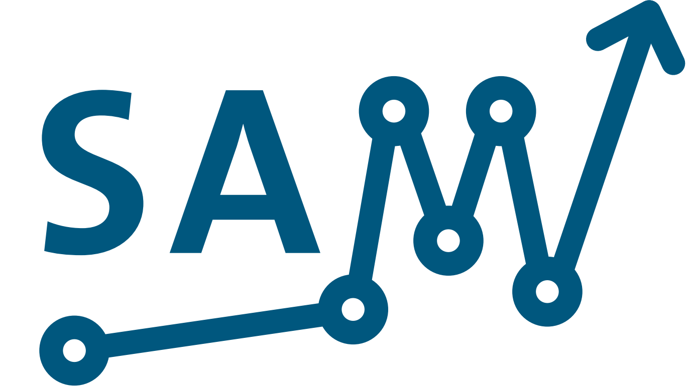

<div align="center">
    <br>
</div>

# SAM

[](https://pypi.org/project/sam/)
[](https://sam-rhdhv.readthedocs.io/en/latest/?badge=latest)
[](https://pepy.tech/project/sam)
[](https://github.com/RoyalHaskoningDHV/sam/blob/main/LICENSE)
[](https://github.com/psf/black)
[](https://pycqa.github.io/isort/)

SAM (Smart Asset Management) is a Python package for *timeseries analysis*, *anomaly detection* and *forecasting*.

The documentation is available on [ReadTheDocs](https://sam-rhdhv.readthedocs.io/en/latest/).

Author: [Royal HaskoningDHV](https://global.royalhaskoningdhv.com/)

Email: [ruud.kassing@rhdhv.com](mailto:ruud.kassing@rhdhv.com)

## Getting started

### Installation

The easiest way to install is package is using pip:
```
pip install sam
```

There are different optional dependencies for SAM, if you are unsure use `pip install 'sam[all]'` other options include `plotting` (just use the plotting functionality), `data_science` (all dependencies needed for a data scientist) and `data_engineering` (dependencies for data engineer).

Keep in mind that the sam package is updated frequently, and after a while, your local version may be out of date with the online documentation. To be sure, run the `pip install -U sam` command to install the latest version.

### Simple example

Below you can find a simple example on how to use one of our timeseries models. For more examples, check our [example notebooks](https://github.com/RoyalHaskoningDHV/sam/tree/main/examples)

```python
from sam.datasets import load_rainbow_beach
from sam.models import MLPTimeseriesRegressor
from sam.feature_engineering import SimpleFeatureEngineer

data = load_rainbow_beach()
X, y = data, data["water_temperature"]

# Easily create rolling and time features to be used by the model
simple_features = SimpleFeatureEngineer(
    rolling_features=[
        ("wave_height", "mean", 24),
        ("wave_height", "mean", 12),
    ],
    time_features=[
        ("hour_of_day", "cyclical"),
    ],
    keep_original=False,
)

# Define your model, see the docs for all parameters
model = MLPTimeseriesRegressor(
    predict_ahead=(1, 2, 3), # Multiple predict aheads are possible
    quantiles=(0.025, 0.975), # Predict quantile bounds for anomaly detection
    feature_engineer=simple_features,
    epochs=20,
)
model.fit(X, y)
```

### Configuration

A configuration file can be created as `.config` and should be located in your working directory. This configuration file only stores api credentials for now, but more options may be added in the future. The configuration file is parsed using the [Python3 configparser](https://docs.python.org/3/library/configparser.html), and an example configuration is shown below:

```ini
[regenradar]
url=https://rhdhv.lizard.net/api/v3/raster-aggregates/?
user=user.name
password=secret

[openweathermap]
apikey=secret
```

## Issue tracking and Feature Requests

Anyone can create feature requests or bug reports! You can browse and create new issues on GitHub: https://github.com/RoyalHaskoningDHV/sam/issues
