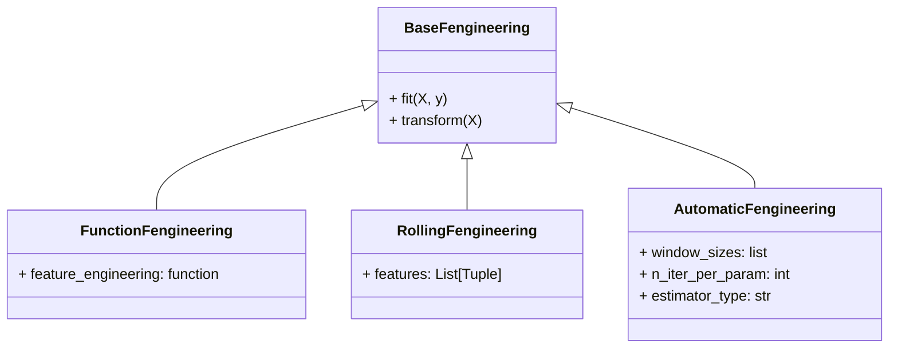

## Refactor feature engineering

Idea: Currect feature engineering approach feels restrictive and too complex.

New approach: Make a base feature engineering pipeline that any data scientist can use as they please.
From that class, default subclasses can be derived

There is no default feature engineering transformer / pipeline at the moment. Only `BuildRollingFeatures`, which is
not sufficient so a complex passthrough and columnwise transform is required. This feels awkward.

Most flexible approach: Let `BaseTimeseriesRegressor` accept a feature engineering pipeline.

In most projects, a function would suffice for feature engineering. Therefore, a simple class that turns this 
function into a transformer will help as well.

