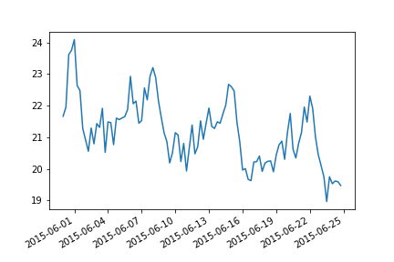

.. _data_sources:

=============
Data Sources
=============

This is the documentation for data sources functions.

Create Synthetic Data
---------------------
.. autofunction:: sam.data_sources.synthetic_date_range
.. autofunction:: sam.data_sources.synthetic_timeseries

Read Weather API's
------------------
.. autofunction:: sam.data_sources.read_knmi_stations
.. autofunction:: sam.data_sources.read_knmi_station_data
.. autofunction:: sam.data_sources.read_knmi
.. autofunction:: sam.data_sources.read_openweathermap
.. autofunction:: sam.data_sources.read_regenradar

Mongo wrapper
-------------
.. autoclass:: sam.data_sources.MongoWrapper
    :members:
    :undoc-members:
    :show-inheritance: