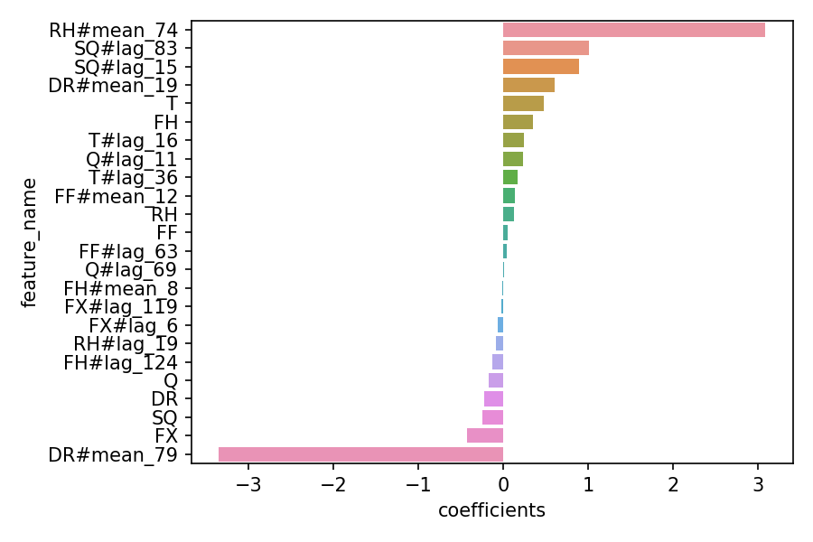

.. _feature_engineering:

===================
Feature Engineering
===================

This is the documentation for feature engineering. Please see `Features <general_documents/feature_extraction.md>`_ for further details on which features to use.

Feature engineering for timeseries
-----------------------------------
.. autoclass:: sam.feature_engineering.BaseFeatureEngineer
    :members:
    :undoc-members:
    :show-inheritance:

.. autoclass:: sam.feature_engineering.FeatureEngineer
    :members:
    :undoc-members:
    :show-inheritance:

.. autoclass:: sam.feature_engineering.IdentityFeatureEngineer
    :members:
    :undoc-members:
    :show-inheritance:

.. autoclass:: sam.feature_engineering.SimpleFeatureEngineer
    :members:
    :undoc-members:
    :show-inheritance:
.. seealso::
   https://www.kaggle.com/avanwyk/encoding-cyclical-features-for-deep-learning
   http://blog.davidkaleko.com/feature-engineering-cyclical-features.html

Rolling Features
----------------
.. autoclass:: sam.feature_engineering.BuildRollingFeatures
    :members:
    :undoc-members:
    :show-inheritance:

.. autofunction:: sam.feature_engineering.range_lag_column

Automatic Rolling Engineering
-----------------------------

.. autoclass:: sam.feature_engineering.AutomaticRollingEngineering
    :members:
    :undoc-members:
    :show-inheritance:

Rolling feature importances

Testset timeseries image:
.. image:: general_documents/images/automatic_rolling_engineering.png

Decompose datetime
------------------
.. autofunction:: sam.feature_engineering.decompose_datetime

Cyclical features
-----------------
.. autofunction:: sam.feature_engineering.recode_cyclical_features
.. seealso::
   https://www.kaggle.com/avanwyk/encoding-cyclical-features-for-deep-learning
   http://blog.davidkaleko.com/feature-engineering-cyclical-features.html

Weather features
-----------------------------
.. autoclass:: sam.feature_engineering.SPEITransformer
    :members:
    :undoc-members:
    :show-inheritance:
