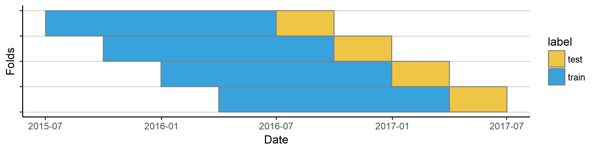
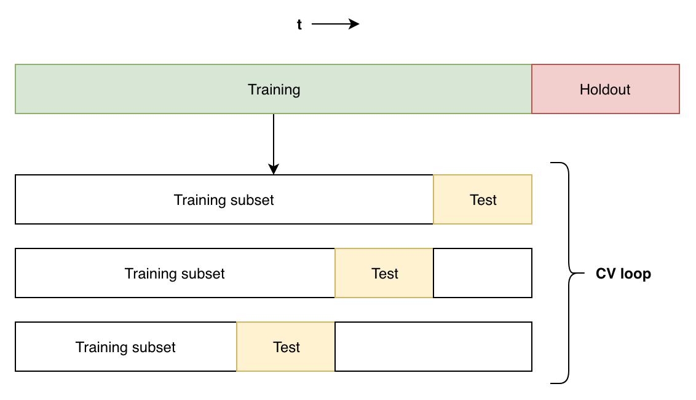

Project approach
==================

In this document we describe the typical steps to take in a sensor analysis project.

## Before the project 
Use the SAM package as much as possible. If relevant functionality is missing, let us add that and extend the package.

Tip: read the tips!

### General notes, tips and tricks
* Events that we're trying to predict are typically rare. That means 
    * high performance, like 90% precision, is unrealistic. Always compare performance to a current situation without the model.
    * supervised learning will generally be difficult if there's not a ton of data (containing incidents/anomalies).
* Often someone responsible for asset operation will have definitions/thoughts on what is an anomaly/incident. Can also be
    * a machine not functioning for a while: an outage
    * a output sensor value going over a threshold
    * a sensor value acting differently than a related sensor (in the same pipe for example)
* Anomalies found by unsupervised methods are often too hard to interpret by the end user and thus less valuable.
* SAM has build-in logging capabilities, use those to keep track of the processing steps from data ingestion to model outcome.

## Preprocessing
Data from sensors should be nicer to work with than data typed in by humans, but preprocessing still requires attention. Important to note is that some anomalies in the data are the stuff that we're trying to find/predict, so we should not take those out. Think of sensor values becoming "too low" due to sensor drift, or "missing data" due to machine failure.

### Picking the target variable 
The choice of target variable is of course crucial to the success of the model. You could 
* Predict the future value of a variable by shifting it backward
    * When predicting a future variable value, consider _predicting the derivative instead_. This might make the model more robust to for example shifts in the whole dataset (e.g. recalibrating a sensor), or application in a different situation (e.g. another Nereda reactor with overall lower values). 
* Predict the current value of a variable for anomaly detection
* Create a binary variable indicating another variable being above (1) or below (0) a threshold. Then shift that variable backwards and predict it.
* Create a multiclass variable for bins of the target variable, e.g. <0, 0-1, 1-2, 3-4, >4, shift that backward and predict it.
* Predict the time (continuous) to a next event by adding a column containing time to a specific future event (like failure).
* Predict the absence of data in a specific variable (binary) due to down time. Can also be shifted backwards for early warning.

### Labelling data
We've joined RHDHV to make use of their domain expertise, which can be implemented by having domain experts label data for us. Could also be anyone outside of RHDHV with domain knowledge of course ;-) We have good experience with using Grafana for labelling of time series data. Typically you would create a Grafana dashboard from the data that's in Influx or MongoDB, create IPA-accounts for the colleagues doing the labelling and have them use the annotation tool in Grafana to do the actual labelling in one of the graphs. Ask Ruben, Rutger or Fenno to get you up to speed on this. 

Grafana is part of the SAM platform and be found [here](https://grafana-sam.ynformed.nl).

## Sampling
Data from sensors is usually timestamped. When sampling data into train/test/validation sets it is often important to **keep the time order intact**. After all, training on a set that is chronologically after the test set can lead to information leakage: you are predicting the past. This is especially the case when predicting processes that evolve over time, and thus have interdependent events, e.g. the biological Nereda process.

### Cross validating with sliding window

If we have enough data, we can cross validate using a sliding window over time. 

### Cross validating with present holdout set

Here we divide the data in multiple blocks, use the most recent as holdout/validation set and randomly assigning the other blocks to train/test. The latter are used for model optimisation with the holdout set providing a representative view of actual performance. 

_Note that this performance on the holdout set is heavily influenced by the amount of (or lack of) events happening in that set._

**References**
* [Sklearn's GroupShuffleSplit](https://scikit-learn.org/stable/modules/generated/sklearn.model_selection.GroupShuffleSplit.html)
* [Sklearn's TimeSeriesSplit](https://scikit-learn.org/stable/modules/generated/sklearn.model_selection.TimeSeriesSplit.html)
* https://towardsdatascience.com/time-series-nested-cross-validation-76adba623eb9

### Discarding old data 
Imagine a process that is evolving over time, e.g. a biological process. Origin of events might change over time, making it less useful to include "old" events in your training data when predicting events tomorrow. Test this by discarding "old" data from training and see if performance improves.

### Up/down sampling
When doing classification, the events to predict are usually rare. You could therefore try to (randomly) down-sample the majority class to e.g. a 50-50 distribution in the train set, or synthetically generate new minority class samples.

## Feature engineering
Whereas time series models (and RNN's) extract time-related features from the data themselves, classification methods don't. We have to generate these ourselves. Obvious features are lags of current values, aggregated lags like `min`, `max`, `avg`, but we can also use for example [Fourier transforms](https://en.wikipedia.org/wiki/Fourier_transform) or the like. These have mostly been implemented in SAM's `sam.feature_engineering.BuildRollingFeatures` class, see [the docs](http://10.2.0.20/sam/feature_engineering.html#rolling-features).

Loes has done some more extensive research on these features, which can be found [here](/sam/general_documents/feature_extraction.html). An extensive amount of these features can also be implemented using the `tsfresh` Python package.

** References **
* [tsfresh documentation](https://tsfresh.readthedocs.io/en/latest/)

## Feature selection
The feature space in a typical time series classification project rapidly grows big due to all these lag features etc. That might not matter in most cases when you aim for maximum performance. When you need an explicable model though, you'll want less features. There are several visualisations/analyses that can be used to only select relevant features:

* Autocorrelation plots: see how a (target) features correlates with itself over time, and only select high correlating lags as features 
* Cross-correlation plots: see how much a feature correlates with the target over time, and only select high correlating lags of the feature 

** References **
* See http://10.2.0.20/sam/feature_selection.html

### Using the target variable as feature 
Using historic values of the target variable as feature improves predictions, but is not always valid. 

** Valid **
* When predicting a variable going over threshold. Be careful with evaluation though: if the model just learns that once a value is > threshold the next value is also > threshold, it might get really good performance without actually making any useful prediction.

** Not valid **
* When building a model for explanation of for example high values in the target variable.

## Modelling: classification
You're typically doing analysis on time series data. That can be done either using time series
models like ARIMA, using RNN's, or using general classification techniques like Random Forest. 
Time series models are good at trends and seasonalities, but can also encompass other confounding
variables. There are limited to being trained on a single time series though, a limitation that we
can overcome by using other classification techniques.

Also keep in mind that a target variable might not be continuous: it can be boolean for surpassing
a threshold yes/no, or maybe even categorical.

**In general**
* Single time series, not many confounding variables, continuous outcome, heavy trends and 
seasonalities: **time series analysis** like ARIMA. Try packages like [Facebook's Prophet](https://github.com/facebook/prophet). 
Example usage:
    * Visitors on a webpage
    * Temperature in our office
    * Power usage in a building
* Learning from one/multiple time series, confounding variables, no macro trends (gradual upward
shift), continuous/discrete outcome: **classification models** like XGB.
* Being the cool kid on the block: RNN's.

## Modelling: anomaly detection
Using anomaly detection techniques we can detect non-predefined anomalies. Imagine a sensor measuring a water level in a river: it is hard to set hard thresholds for this sensor as the value is heavily influenced by e.g. the amount of rain fall. High water might be a good thing when it has rained, but an anomaly when it hasn't. Better than setting thresholds would be a dynamic way of detecting anomalies.

### Quantile regression
With quantile regression we build a classification model that predicts both the sensor value and a confidence interval around it. After "predicting" the current value we see if the actual value is within the confidence interval, if it is not, it is an outlier.

These ranges of outliers might form specific patterns. When sensor drift is occurring for example, the measured values with slowly drift below the confidence interval. If we calculate summary statistics on the range of outliers, we could **classify what is going on** and possibly prioritise the outlier accordingly.

_Note that you'll want to do some filtering on the anomalies found, often a single minimal anomaly is not enough to warn a user. More on that later when Lieke has progressed her research._

**References**
* [Quantile regression tree implementations in Python](https://scikit-garden.github.io/examples/QuantileRegressionForests/)
* Finding outliers in quantile regression predictions [`sam.train_models.find_outlier_curves`](http://10.2.0.20/sam/train_models.html?highlight=find_outlier_curves#sam.train_models.find_outlier_curves)

### Isolation Forest
An example of unsupervised anomaly detection capable of handling non-numeric features. The model attempts to predict whether an instance is "odd" compared to what it has seen in the training set. 

The difficult thing here, when doing asset management projects, is that it is often unclear what exactly causes something to be an anomaly. That makes it hard to grasp for the end user and even harder to act upon.

**References**
* [IsolationForest implementation in Sklearn](https://scikit-learn.org/stable/modules/generated/sklearn.ensemble.IsolationForest.html)

## Evaluation
In general the cases that we're trying to predict or identify are **rare**. It is important to keep
that in mind when evaluating model performance: 30% precision predicting an incident that happens
0.5% of the time is very good!

There is a number of metrics that make sense when evaluating predictive models for e.g. predictive
maintenance.

### Incident recall
If we predict incidents X time steps in advance, all these time steps will have a positive target
variable. Recall with regard to all these positives is not representative for performance: if we 
predict half of the time steps correct we might flag all incidents but have a 50% recall.

Therefore we want to measure the amount of incidents that we're able to flag: the incident recall.
This combined with precision gives a good indication of the model's usability in practice. For 
example:

> If I get a warning, it is right 30% of the time (precision). By acting on warnings I'm able to 
prevent up to 90% of incidents (incident recall).

**References**
* Metric implementation (sklearn compatible) `sam.metrics.incident_recall`
* Visualisation of precision vs. incident recall for multiple thresholds `sam...`

## Other good reads 
* https://datascopeanalytics.com/blog/unevenly-spaced-time-series/