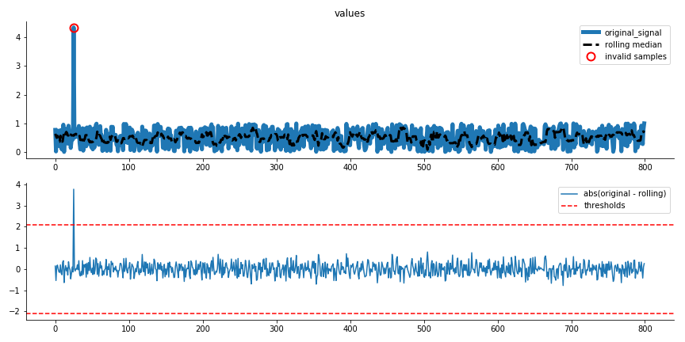

.. _validation:

=============
Data Validation
=============

This is the documentation for the validation functions.

Detect Extreme Values
---------------------------
.. autoclass:: sam.validation.RemoveExtremeValues
    :members:
    :undoc-members:
    :show-inheritance:

Trainset image:

Testset image:

.. image:: general_documents/images/extreme_values_example_testset.png

Detect Flatlines
---------------------------
.. autoclass:: sam.validation.RemoveFlatlines
    :members:
    :undoc-members:
    :show-inheritance:

Trainset image:

.. image:: general_documents/images/flatline_removal_example.png

Create validation Pipeline
---------------------------
.. autofunction:: sam.validation.create_validation_pipe
