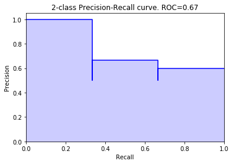
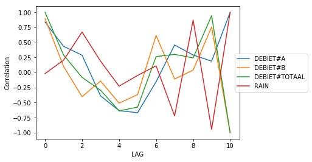
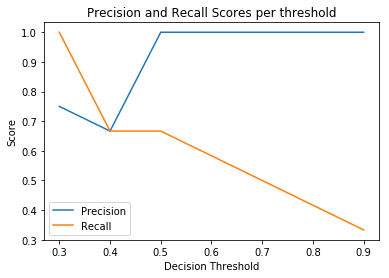
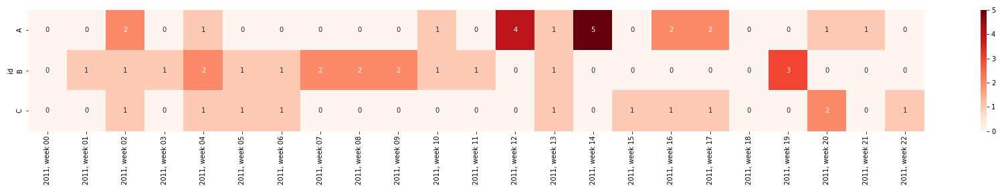
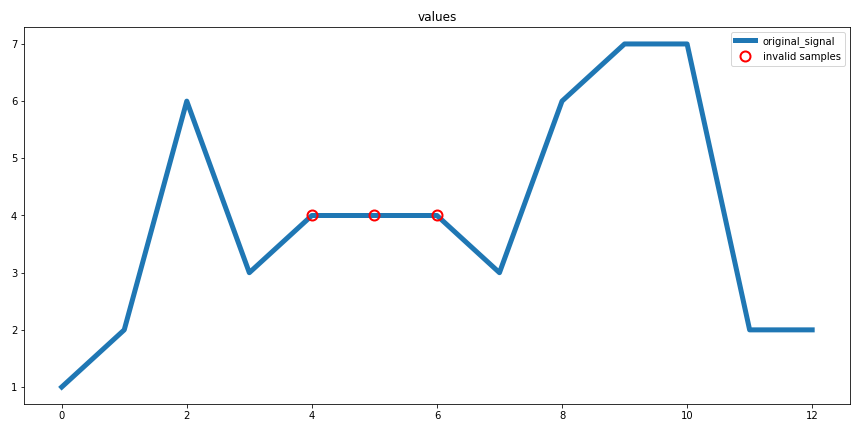
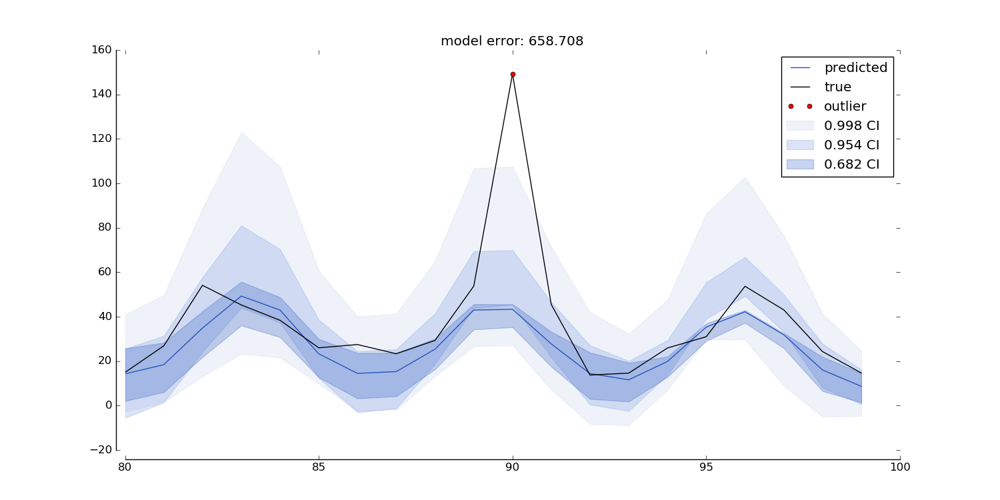
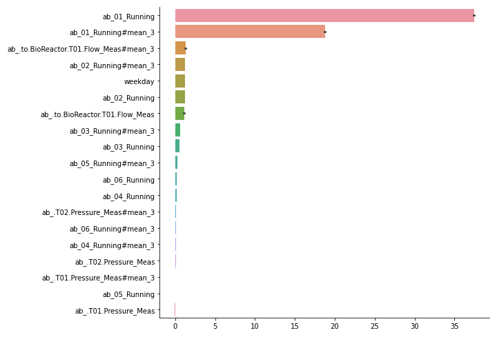
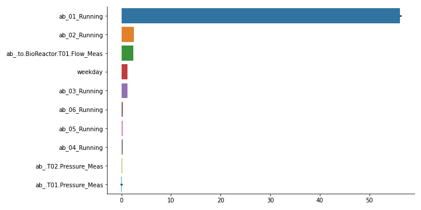

.. _visualization:

=============
Visualization
=============

This is the documentation for visualization functions.

Precision Recall curve plot
---------------------------
.. autofunction:: sam.visualization.plot_precision_recall_curve

Autocorrelation plot
--------------------
.. autofunction:: sam.visualization.plot_lag_correlation

Threshold curve plot
---------------------------
.. autofunction:: sam.visualization.plot_threshold_curve

Incident heatmap plot
---------------------------
.. autofunction:: sam.visualization.plot_incident_heatmap

.. _flatline-removal-plot:

Flatline Removal plot
-----------------------
.. autofunction:: sam.visualization.diagnostic_flatline_removal

.. _extreme-removal-plot:

Extreme value removal plot
---------------------------
.. autofunction:: sam.visualization.diagnostic_extreme_removal

.. image:: general_documents/images/extreme_values_example_testset.png

Quantile Regression plot
---------------------------
.. autofunction:: sam.visualization.sam_quantile_plot

Feature importances plot
---------------------------
.. autofunction:: sam.visualization.plot_feature_importances

Evaluate predict ahead
---------------------------
.. autofunction:: sam.visualization.performance_evaluation_fixed_predict_ahead
