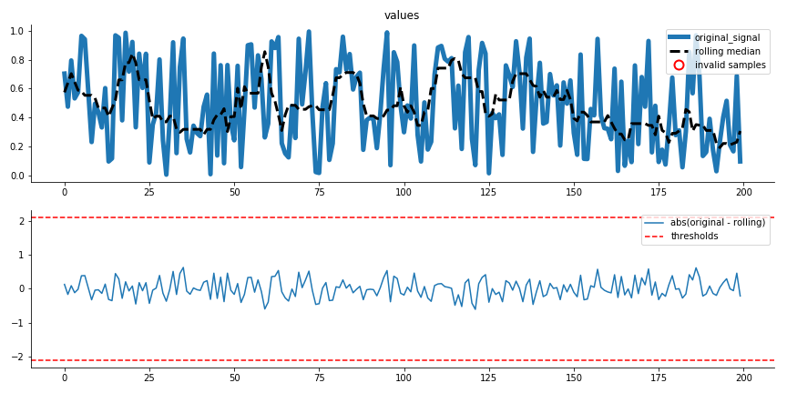

.. _visualization:

=============
Visualization
=============

This is the documentation for visualization functions.

Precision Recall curve plot
---------------------------
.. autofunction:: sam.visualization.plot_precision_recall_curve

.. image:: general_documents/images/precision_recall_curve.png

Autocorrelation plot
--------------------
.. autofunction:: sam.visualization.plot_lag_correlation

Threshold curve plot
---------------------------
.. autofunction:: sam.visualization.plot_threshold_curve

.. image:: general_documents/images/threshold_curve.png

Incident heatmap plot
---------------------------
.. autofunction:: sam.visualization.plot_incident_heatmap

.. image:: general_documents/images/incident_heatmap.png

.. _flatline-removal-plot:

Flatline Removal plot
-----------------------
.. autofunction:: sam.visualization.diagnostic_flatline_removal

.. _extreme-removal-plot:

Extreme value removal plot
---------------------------
.. autofunction:: sam.visualization.diagnostic_extreme_removal

Quantile Regression plot
---------------------------
.. autofunction:: sam.visualization.sam_quantile_plot

Feature importances plot
---------------------------
.. autofunction:: sam.visualization.plot_feature_importances

.. image:: general_documents/images/quantile_importances_barplot_sum.png

Evaluate predict ahead
---------------------------
.. autofunction:: sam.visualization.performance_evaluation_fixed_predict_ahead
